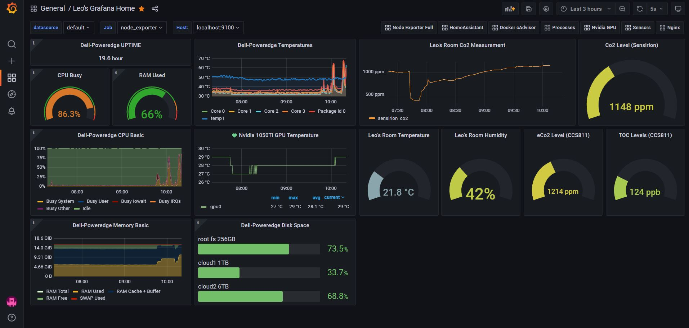

## Use case

Docker stack I have deployed in my homelab server (with Ubuntu 18.04) to monitor various hardware and software resources.
Basically it runs grafana with prometheus for metrics collection, promtail/loki for logs collection and influxdb as time-series database (collecting data from telegraf and from various sensor nodes via homeassistant/nodered stack).

### Prometheus scrapers
- Node exporter (various system stats like CPU usage, memory, disk, network, etc.)
- Sensors exporter (temp sensors and fan speeds)
- GPU exporter (monitoring Nvidia GPU)
- cAdvisor (monitor docker containers usage)

### Loki tasks
- Nginx reverse proxy logs monitoring
- System logs

### Grafana Dashboards
- Home Dashboard (custom created, source in grafana_home_dashboard.json):

- Node exporter: https://grafana.com/grafana/dashboards/1860
- Sensor exporter: https://github.com/epfl-sti/cluster.coreos.prometheus-sensors
- GPU exporter: https://grafana.com/grafana/dashboards/6387
- cAdvisor: https://grafana.com/grafana/dashboards/193
- Nginx: https://grafana.com/grafana/dashboards/12559

### Instructions
- Create system users on host system. Alternatives: user: 1000 (to run containers as main system user) or comment out "user" parameter for the services in docker-compose.yml and run every container as root)
- Run the stack with docker-compose up -d
